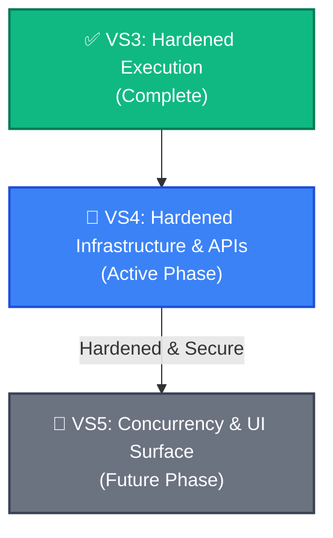

# Stratum v2 — Spec Alignment & Hardening Roadmap

**Date:** 2026-05-23  
**Status:** Approved Roadmap  
**Prerequisites:** VS3 Complete (Real subprocess EXEC, multi-turn agents, debugger loop)  
**Target Specs:** job-dispatch.md, validation.md, document-linking.md, context-manager.md, daemon-api.md, dag-node-reference.md, intake-and-sharding.md, ui-shell.md, tasks-dashboard.md

---

## 🗺️ Architectural Concept Realignment

To build the full system as specified, we must address the **Spec-to-Code Divergence** systematically. 

Instead of adding more features on top of host-based, unsecured stubs and memory-only states, we reorganize the remaining development into two rigorous, spec-aligned vertical slices: **Vertical Slice 4 (VS4: Hardened Infrastructure)** and **Vertical Slice 5 (VS5: Concurrency & Graphical Interface)**.

---

## 🚀 Vertical Slice 4: Hardened Infrastructure & APIs

*   **Theme:** Secure containerization, tri-phase category-cached validation, AST-less trace-link indices, token-budgeted context slices, and standardized HTTP responses.
*   **Target Specs:** [job-dispatch.md](../specs/job-dispatch.md), [validation.md](../specs/validation.md), [document-linking.md](../specs/document-linking.md), [context-manager.md](../specs/context-manager.md), [daemon-api.md](../specs/daemon-api.md), [daemon-api-endpoints.md](../specs/daemon-api-endpoints.md).
*   **Status:** **ACTIVE PHASE**

### Phase A: Job Dispatch & Worker Pools (`specs/job-dispatch.md`)
*   **Core Objective:** Replace native subprocess execution with a containerized **Worker Pool** managing concurrent validation jobs inside Docker sandboxes.
*   **Key Specs Alignment:**
    *   Implement `Job` queue, state machine (`queued` -> `preparing` -> `running` -> `collecting` -> `completed/failed`), and scheduling based on `JobPriority` (0..3).
    *   Create the `WorkerPool` interface handling `Worker` heartbeats, draining states, and dynamic container limits (CPU/Memory).
    *   Enforce standard volume mounts mapping the run directory, project source (read-only), test scripts (read-only), and context pack.

### Phase B: Tri-Phase Validation Gate (`specs/validation.md`)
*   **Core Objective:** Implement the tri-phase execution pass (`static-check` -> `llm-check` -> `exec-check`) across categories with caching.
*   **Key Specs Alignment:**
    *   Enforce sequential execution: if `static-check` fails globally, downstream checks are bypassed.
    *   Validate the 10 built-in categories (such as static analysis, LLM semantic checks, and functional tests).
    *   Compute deterministic `VALIDATION_GATE` verdicts using `CategoryRunResult` schema blocks, completely isolated from LLM decision making.

### Phase C: Semantic Trace-Link Index (`specs/document-linking.md`)
*   **Core Objective:** Build a persistent, traversable trace-link knowledge graph utilizing typed reference addressing (`doc:{key}`, `node:{group}:{key}`) and manual `[[wikilink]]` parsing.
*   **Key Specs Alignment:**
    *   Create forward link indexing and compute memory-only bidirectional backlinks.
    *   Store indices in `.sle/link-index/` as `forward-links.json`, `file-index.json`, and `document-index.json`.
    *   Implement Link Tiers (Tiers 1 and 2 structural and contextual linking).

### Phase D: Five-Component Context Manager (`specs/context-manager.md`)
*   **Core Objective:** Assemble precise, budget-tracked LLM context slices under a hard 3,500-token cap.
*   **Key Specs Alignment:**
    *   Enforce the five-component order: System Prompt, Artifact Slices, State Summary, Task, and Failure Context.
    *   Implement `SliceRule` processing (mode definitions and truncation weights) to prevent context overflows.

### Phase E: API Contract Compliance (`specs/daemon-api-endpoints.md`)
*   **Core Objective:** Map and refactor the active daemon endpoints to strictly match the request/response envelopes (`APIResponse<T>`, `APIError`) and Zod schemas.

---

## 🔭 Vertical Slice 5: Concurrency & UI Surface

*   **Theme:** Critic advisories, multi-shard intake pipelines, real-time WebSocket state broadcasting, and the visual desktop interface.
*   **Target Specs:** [dag-node-reference.md](../specs/dag-node-reference.md), [intake-and-sharding.md](../specs/intake-and-sharding.md), [ui-shell.md](../specs/ui-shell.md), [tasks-dashboard.md](../specs/tasks-dashboard.md), [daemon-api.md](../specs/daemon-api.md).
*   **Status:** **FUTURE PHASE**

### Phase A: Critic Agent Routing (`specs/dag-node-reference.md`)
*   **Core Objective:** Insert the `CRITIQUE` node (Node 3) into the DAG sequence, running after `DESIGN` at deep/research depth.
*   **Key Specs Alignment:**
    *   Enforce advisory semantics (Critic reviews but never halts the DAG; Designer must address blockings).
    *   Produce dual outputs: `doc:critique-feedback` (for Designer consumption) and `node:critic:critique` (ephemeral run log).

### Phase B: 6-Step Intake & Sharding Pipeline (`specs/intake-and-sharding.md`)
*   **Core Objective:** Decompose high-level intents into concurrent sub-tasks under a unified cycle execution plane.
*   **Key Specs Alignment:**
    *   Implement the 6-step sharding pipeline: document intake -> coherence gate -> sharding -> approval -> task creation -> link index update.
    *   *Correction:* Sharding creates sub-tasks within a single cycle context, not parallel cycles.

### Phase C: WebSocket Event Bus (`specs/daemon-api.md` & `specs/daemon-api-endpoints.md`)
*   **Core Objective:** Emit real-time lifecycle updates over a WebSocket event bus using dotted names (`cycle.started`) and flat envelopes.

### Phase D: UI Shell & Tasks Dashboard (`specs/ui-shell.md` & `specs/tasks-dashboard.md`)
*   **Core Objective:** Construct the 3-page local HTML desktop interface (Overview with 6 panels, Chat, Graph) and dynamic widgets.
