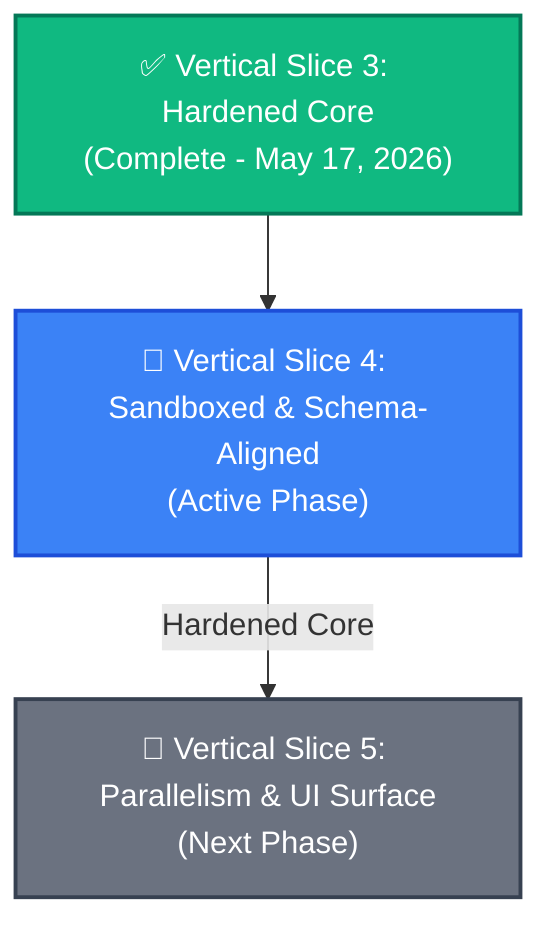

# Stratum v2 — Spec Alignment & Hardening Roadmap

**Date:** 2026-05-23  
**Status:** Approved Roadmap  
**Prerequisites:** VS3 Complete (Real subprocess EXEC, multi-turn agents, debugger loop)  
**Target:** 100% compliance with core Stratum architectural specifications.

---

## 🗺️ Executive Overview

This roadmap re-orchestrates the remaining development phases of **Stratum v2** (formerly *SLE* / *sdk-orchestrator*). 

Previously, Vertical Slice 4 (VS4) was designed to expand the agent roster (Critic, Sharding gates) while leaving the core engine running insecurely on the host machine. 

To prevent compounding architectural debt, this plan **realigns and hardens the system first**. We prioritize secure Docker sandboxing and semantic link-indexing in a restructured **Vertical Slice 4**, ensuring a rock-solid, production-grade foundation before building concurrency, parallel sharding, and UI elements in **Vertical Slice 5**.

---

## 🚀 Vertical Slice 4: Sandboxed & Schema-Aligned

*   **Theme:** Erase critical security vectors, eliminate context overflows, and standardize API contracts.
*   **Target Specs:** [validation.md](../specs/validation.md), [document-linking.md](../specs/document-linking.md), [daemon-api.md](../specs/daemon-api.md).
*   **Status:** **ACTIVE PHASE**

### Phase A: Docker Sandbox Execution (`specs/validation.md`)
*   **Core Objective:** Replace host subprocess execution with sandboxed Docker containers in the `EXEC` node.
*   **Engineering Tasks:**
    *   Create a base Docker image (`stratum-runner:latest`) pre-configured with active runtime runtimes (Node, Python).
    *   Refactor `src/exec-service.ts` to spin up containers, mount the local workspace snapshot directory as a read-only or isolated volume, and run the validation scripts inside the container.
    *   Implement volume streaming and secure output retrieval to capture lints, test runs, and compile errors.
    *   *Security Constraint:* Unrestricted host terminal commands are blocked; network access inside the container is isolated.

### Phase B: Local Link Index DAG (`specs/document-linking.md`)
*   **Core Objective:** Implement a lightweight, zero-dependency, local **Link Index DAG** to compile file-to-file requirements, test references, and code dependencies, replacing the deprecated Cognee engine.
*   **Engineering Tasks:**
    *   Write a custom AST static dependency scanner in `src/discovery-service.ts` or `src/context-manager.ts` to map codebase relationships.
    *   Construct the Link Index DAG inside `.sle/map.yaml` using the specified `UnifiedMetadata` schema.
    *   Refactor `src/context-manager.ts` to query this local index, constructing a budget-tracked, semantic context slice (`AssembledContext`) for the Builder and Tester agents.

### Phase C: Daemon API Schema Compliance (`specs/daemon-api.md`)
*   **Core Objective:** Standardize the existing 18 active REST endpoints in `src/daemon.ts` to match the exact JSON payload shapes and response schemas detailed in the specifications.
*   **Engineering Tasks:**
    *   Ensure all endpoint outputs are strictly structured and validated using Zod models matching `specs/daemon-api-endpoints.md`.
    *   Standardize the `FailureReport` format returned by the `VALIDATION_GATE` on test fail.

### 🧪 VS4 Integration Tests & Verification
*   **Test Case 1 (Security Sandbox):** A cycle that attempts to run a malicious shell script on the host (e.g., `touch /tmp/hacked`) is safely blocked, executing only inside the sandboxed Docker volume.
*   **Test Case 2 (Link Context):** A cycle where the Builder is fed a token-bounded context slice generated semantically from the local Link Index, successfully compiling a multi-file dependency change.

---

## 🔭 Vertical Slice 5: Parallelism & UI Surface

*   **Theme:** Advanced multi-agent concurrency, reactive user feedback, and the graphical desktop surface.
*   **Target Specs:** [dag-node-reference.md](../specs/dag-node-reference.md), [intake-and-sharding.md](../specs/intake-and-sharding.md), [ui-shell.md](../specs/ui-shell.md).
*   **Status:** **FUTURE PHASE**

### Phase A: Critic Agent (`specs/dag-node-reference.md`)
*   **Core Objective:** Insert the `CRITIQUE` node (Node 3) into the active `DAG_SEQUENCE` running after the `DESIGN` node.
*   **Engineering Tasks:**
    *   Build the Critic agent prompt template (`prompt-templates.ts`) to review `architecture.md` and `requirements.md`.
    *   Implement routing logic in `src/cycle-runner.ts` that loops back to `DESIGN` with structured critique files on `BLOCKING` reviews.

### Phase B: Task Sharding & Gates (`specs/intake-and-sharding.md`)
*   **Core Objective:** Decompose complex developer intents into distinct concurrent cycles (shards) executing in parallel.
*   **Engineering Tasks:**
    *   Implement the `SHARDING_APPROVAL` gate (Node 6) allowing user confirmation of the Planner's sharding proposal.
    *   Build multi-cycle execution pipelines in `src/cycle-runner.ts`.

### Phase C: WebSocket Event Bus (`specs/daemon-api.md`)
*   **Core Objective:** Broadcast real-time execution states using the canonical `SLE-005` event envelope.
*   **Engineering Tasks:**
    *   Refactor the active event system to use a standard `EventBus`.
    *   Implement a persistent WebSocket server at `ws://localhost:7700/events` broadcasting dotted event formats (`cycle.started`, `node.completed`).

### Phase D: The UI Dashboard Shell (`specs/ui-shell.md`)
*   **Core Objective:** Construct the web dashboard shell to visualize real-time run metrics, workspace diffs, and confirmation prompts.
*   **Engineering Tasks:**
    *   Develop a reactive Single Page Application (HTML/JS) running inside a local server.
    *   Bind the UI directly to the WebSocket event bus and the hardened REST API endpoints built in VS4.

---

## 📈 Spec Divergence Status (Tracked & Addressed)

By executing this roadmap, the major divergences captured in your project audit will be systematically resolved:

| Divergence Target | Original Status | Resolution Phase |
| :--- | :--- | :--- |
| **Docker Sandboxing** | 🔶 Partially Implemented (Host execution) | **VS4 Phase A** (Completed Compliance) |
| **Knowledge Engine (Cognee)** | 🛑 Deprecated & Replaced | **VS4 Phase B** (Resolved via Local Link DAG) |
| **API Schema Completeness** | 🔶 Partially Implemented (21% coverage) | **VS4 Phase C & VS5 Phase C** |
| **Critic Routing** | 📝 Spec Only (Deferred) | **VS5 Phase A** |
| **Task Sharding** | 📝 Spec Only (Deferred) | **VS5 Phase B** |
| **WebSocket Event Bus** | 🔶 Partially Implemented (Stubbed) | **VS5 Phase C** |
| **UI Dashboard Shell** | 📝 Spec Only (Deferred) | **VS5 Phase D** |
